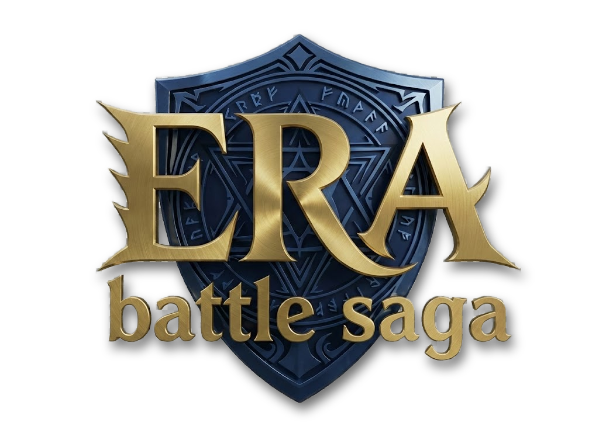

# Era Admin Saga - City Builder

A strategic city-building game where you manage resources, construct buildings, and satisfy the needs of your citizens under the leadership of a powerful General.

## 🎮 Play Now
**[Play Era Admin Saga Directly in Your Browser](https://wox76.github.io/erabattlesaga/)**

---

## ✨ Features

- **Strategic Building System**: Construct various buildings like Houses, Markets, Temples, and Barracks on a grid.
- **Resource Management**: Gather and manage Solidi (Gold), Wood, Stone, Iron, and Food.
- **Realistic Construction**: Buildings take time to construct. Watch them rise from wireframes to full structures!
- **Speed Up**: Impatient? Spend Solidi to finish construction instantly.
- **Citizen Requests**: Listen to your people! Fulfill their requests for rewards.
- **Exploration**: Send scouts to find precious resources in the wild.
- **Generals**: Choose from unique Generals, each with their own bonuses (e.g., faster construction, better economy).
- **3D Graphics**: Built with Three.js for a beautiful 3D isometric view.

## 🕹️ Controls

- **Mouse Left Click**: Select buildings, place structures, interact with UI.
- **Mouse Right Click / Drag**: Rotate the camera.
- **Scroll Wheel**: Zoom in/out.

## 🛠️ Technologies

- **Vanilla JavaScript** (ES6+)
- **Three.js** (3D Rendering)
- **HTML5 & CSS3**

---

*Developed by wox76*
