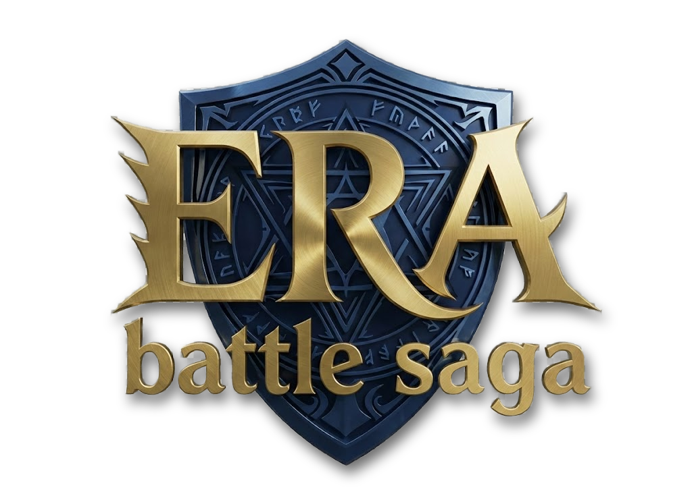
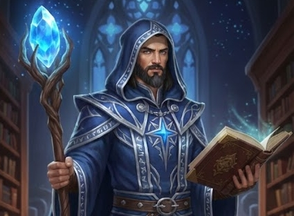
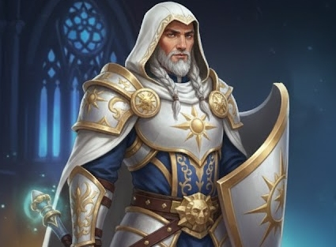
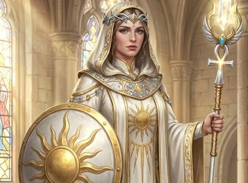
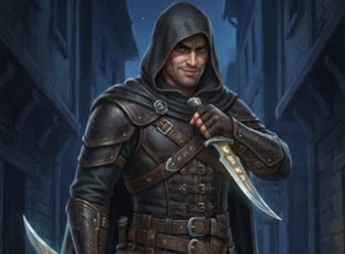
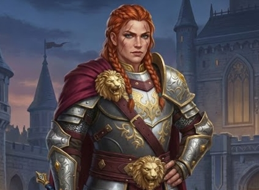
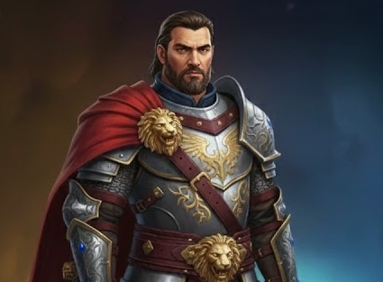

# Era: Battle Saga 🏰

### 🎮 [Gioca Online ora!](https://wox76.github.io/erabattlesaga/)

Benvenuto in **Era: Battle Saga**, un gioco di strategia epico in cui vestirai i panni di un potente regnante incaricato di costruire una città leggendaria, addestrare un esercito imbattibile e dominare il regno.

## 🌟 Caratteristiche Principali

| Città & Economia | Esercito & Conquista | Ricerca & Sviluppo |
| :--- | :--- | :--- |
| Gestisci risorse (Legname, Ferro, Pietra, Cibo, Argento) | Addestra truppe Tier 1 e Tier 2 | Sblocca nuove tecnologie nell'Accademia |
| Costruisci e potenzia oltre 15 edifici unici | Invia marce strategiche sulla mappa del mondo | Forgia equipaggiamenti leggendari nella Fucina |
| Ottimizza la produzione e lo stoccaggio | Sconfiggi mostri e raccogli bottini preziosi | Potenzia le statistiche di attacco e difesa |

## 🛡️ Scegli il tuo Generale

All'inizio del tuo viaggio, potrai scegliere uno tra i **7 leggendari generali** per guidare il tuo popolo. Ogni generale offre bonus passivi unici che influenzeranno la tua strategia.

| Generale | Specializzazione | Ritratto |
| :--- | :--- | :--- |
| **Astralo** | +10% Velocità Ricerca |  |
| **Crom** | +10% Attacco Truppe |  |
| **Gerelt** | +15% Velocità Marcia |  |
| **Helena** | +10% Crescita Popolazione |  |
| **Ordal** | -8% Costo Costruzione |  |
| **Sonya** | +20% Capacità Stoccaggio |  |
| **Talkenbar** | +15% Difesa Mura |  |

## 🏗️ Edifici della Fortezza

Espandi la tua influenza costruendo strutture vitali:
- **Castello**: Il cuore della città.
- **Caserma**: Luogo di addestramento per i tuoi soldati.
- **Accademia**: Centro del sapere e dell'innovazione.
- **Fucina**: Dove vengono create le armi per i campioni.

## 🚀 Come Iniziare

1. Apri `index.html` nel tuo browser.
2. Scegli un nome per la tua città.
3. Seleziona il tuo Generale.
4. Inizia a costruire la tua prima Segheria!

---
*Creato con passione per dominatori e strateghi.*
